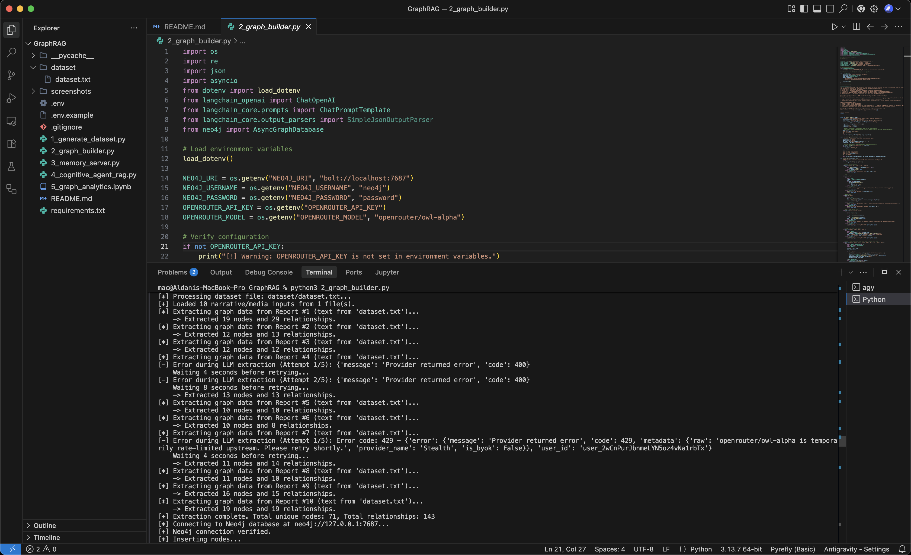
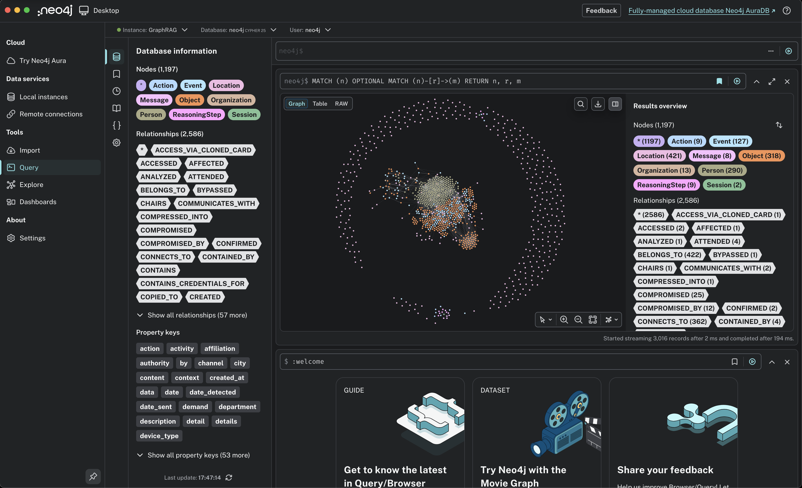
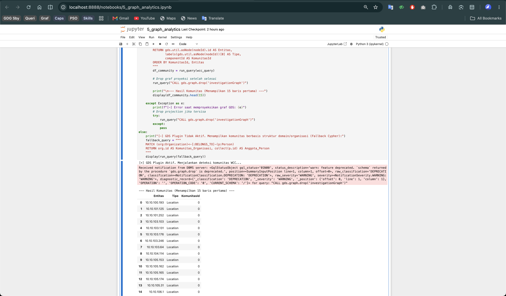
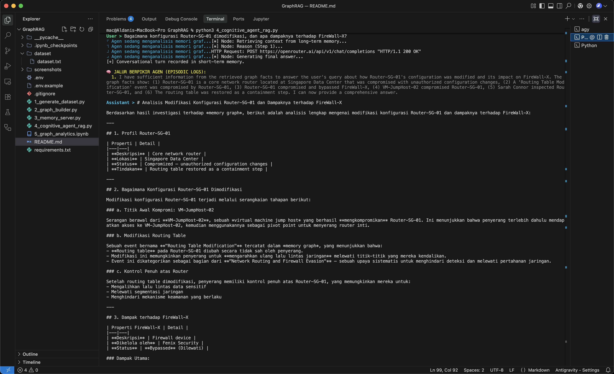

# Sistem Multi-Agen GraphRAG dengan Memori Terdistribusi Neo4j

Proyek ini adalah implementasi **Sistem Multi-Agen AI dengan Memori Terdistribusi** menggunakan **Neo4j** sebagai repositori memori, **LangChain/LangGraph** sebagai kerangka orkestrasi kognitif agen, dan **OpenRouter (owl-alpha)** sebagai Model Bahasa Utama (LLM).

Sistem ini merealisasikan arsitektur memori tiga lapis dalam satu graf:
1. **Short-term Memory (Memori Jangka Pendek)**: Riwayat percakapan interaktif (`Session` & `Message`).
2. **Long-term Memory (Memori Jangka Panjang)**: Ekstraksi fakta entitas POLE+O (`Person`, `Object`, `Location`, `Event`, `Organization`).
3. **Episodic Memory (Memori Episodik)**: Rekaman langkah berpikir agen (`ReasoningStep` & `Action`).

---

## 📂 Struktur Direktori Proyek
```text
GraphRAG/
├── .gitignore                   # Konfigurasi pengabaian file git (seperti .env)
├── requirements.txt             # Daftar dependensi modul Python yang dibutuhkan
├── .env.example                 # Template berkas environment variables
├── dataset/                     # Folder tempat berkas teks naratif dataset (.txt) disimpan
│   └── dataset.txt              # Dataset default hasil generator
├── 1_generate_dataset.py        # STEP 1: Generator cerita teks & topologi graf (>500 node)
├── 2_graph_builder.py          # STEP 2: Ekstraktor teks ke Graf asinkron (RAG)
├── 3_memory_server.py           # STEP 3: Server Memori MCP berbasis Neo4j (FastMCP)
├── 4_cognitive_agent_rag.py     # STEP 3: Agen Kognitif RAG interaktif (LangGraph)
└── 5_graph_analytics.ipynb      # STEP 4: Analisis Graf GDS & Cypher (Notebook)
```

---

## 🛠️ Instalasi & Konfigurasi

### 1. Prasyarat Sistem
* **Python**: Versi 3.9 ke atas.
* **Neo4j**: Versi 5.x Desktop / AuraDB dengan **Graph Data Science (GDS) Plugin** yang telah diaktifkan.

### 2. Pemasangan Dependensi
Buka terminal di dalam folder proyek ini dan jalankan perintah:
```bash
pip3 install -r requirements.txt
```

### 3. Konfigurasi Environment (`.env`)
Salin file `.env.example` menjadi `.env` lalu lakukan penyesuaian untuk kredensial database Neo4j serta kunci OpenRouter API:
```bash
cp .env.example .env
```
Isi file `.env`:
```env
# Koneksi Neo4j Database
NEO4J_URI=bolt://localhost:7687
NEO4J_USERNAME=neo4j
NEO4J_PASSWORD=password_neo4j

# Konfigurasi OpenRouter
OPENROUTER_API_KEY=kunci_api_openrouter
OPENROUTER_MODEL=openrouter/owl-alpha
```

---

## 🚀 Cara Menjalankan Kode (Step 1 s.d. 5)

### STEP 1: Generate & Ingest Dataset Awal
Perintah ini melakukan dua tugas sekaligus:
1. Menghasilkan berkas cerita siber tidak terstruktur di dalam folder `dataset/` (secara default disimpan sebagai `dataset/dataset.txt`).
2. Menyuntikkan secara instan struktur topologi jaringan IT dan karyawan DeltaCorp (total **769 node** dan **1.002 relasi**) langsung ke database Neo4j:
```bash
python3 1_generate_dataset.py
```
*(Catatan: Pastikan database Neo4j lokal sudah aktif dan berkas `.env` sudah dikonfigurasi sebelum menjalankan perintah ini agar proses ingesti graf berhasil).*

### STEP 2: Ekstraksi Cerita Siber RAG (Text-to-Graph & Media)
Proses ini akan memindai folder `dataset/` untuk mencari seluruh berkas naratif dan dokumen siber yang didukung, mengekstrak entitas dan relasi siber (menggunakan LLM OpenRouter), lalu memasukkannya secara asinkron ke graf Neo4j:
```bash
python3 2_graph_builder.py
```
* **Format File yang Didukung**:
  * **Teks & Dokumen**: `.txt`, `.md`, `.pdf`, `.docx`
  * **Tabel & Data**: `.csv`, `.xlsx`, `.xls` (akan diubah ke tabel markdown secara otomatis)
  * **Gambar**: `.png`, `.jpg`, `.jpeg`, `.webp` (memerlukan LLM Multimodal/Vision yang terkonfigurasi di `.env` seperti `google/gemini-2.0-flash-exp:free` atau sejenisnya)
  * **Audio**: `.wav`, `.mp3`, `.m4a`, `.flac`, `.ogg` (akan ditranskrip secara otomatis menggunakan Google Speech Recognition)
  * **Video**: `.mp4`, `.avi`, `.mov`, `.mkv` (akan mengekstrak audio track dan mentranskripnya secara otomatis)
* **Menggunakan Dataset Default**: Proses dapat diawali dengan menjalankan STEP 1 (yang menghasilkan berkas `dataset/dataset.txt`), lalu dilanjutkan dengan menjalankan STEP 2 seperti biasa.
* **Menggunakan Dataset Kustom**: Berkas narasi siber dapat langsung dimasukkan ke dalam folder `dataset/` (baik berupa laporan teks, dokumen PDF, spreadsheet data, rekaman suara, tangkapan layar/gambar, dll.). Script `2_graph_builder.py` secara otomatis akan mendeteksi, mengekstrak, dan menggabungkannya ke dalam graf Neo4j. Jika tidak ingin memproses cerita default DeltaCorp, berkas `dataset/dataset.txt` dapat dihapus terlebih dahulu.
*(Catatan: Untuk format video atau audio selain WAV, pastikan biner sistem `ffmpeg` telah terpasang di perangkat agar proses konversi pydub berjalan lancar).*

### STEP 3: Menjalankan Agen RAG Interaktif
Sistem agen kognitif interaktif dapat dijalankan langsung dari terminal. Agen akan membaca konteks graf (Long-term), menyimpan riwayat percakapan (Short-term), dan mencatat log cara berpikir (Episodic) ke Neo4j:
```bash
python3 4_cognitive_agent_rag.py
```
*(Catatan: File `3_memory_server.py` juga bisa dijalankan sebagai standalone MCP Server jika menggunakan client MCP eksternal).*

### STEP 4: Menjalankan Analisis Graf
Jupyter Notebook digunakan untuk melakukan analisis Degree Centrality, Path Finding (Shortest Path), dan Community Detection (WCC):
```bash
# Perintah standar:
jupyter notebook 5_graph_analytics.ipynb

# Perintah alternatif:
python3 -m notebook 5_graph_analytics.ipynb
```
*(Catatan: Berkas `5_graph_analytics.ipynb` juga bisa dibuka secara langsung di **VS Code** dengan ekstensi Jupyter, lalu memilih kernel Python yang sesuai).*

---

## 🌐 Penggunaan Model Context Protocol (MCP)

Proyek ini mengekspos memori terdistribusi Neo4j melalui protokol standar **Model Context Protocol (MCP)** berbasis FastMCP.

Terdapat dua cara utama untuk mengintegrasikan dan menggunakan server MCP ini:

### 1. Integrasi dengan Claude Desktop (Demo Integrasi AI)
Memori graf Neo4j ini dapat dihubungkan ke aplikasi **Claude Desktop** agar Claude dapat langsung membaca/menulis memori graf saat berinteraksi:
* Buka berkas konfigurasi Claude Desktop di:
  * **macOS:** `~/Library/Application Support/Claude/claude_desktop_config.json`
  * **Windows:** `%APPDATA%\Claude\claude_desktop_config.json`
* Tambahkan konfigurasi berikut (pastikan untuk menyesuaikan path absolut ke berkas python dan kredensial Neo4j):
```json
{
  "mcpServers": {
    "neo4j-memory-server": {
      "command": "python3",
      "args": [
        "/path/to/your/project/GraphRAG/3_memory_server.py"
      ],
      "env": {
        "NEO4J_URI": "bolt://localhost:7687",
        "NEO4J_USERNAME": "neo4j",
        "NEO4J_PASSWORD": "password_neo4j"
      }
    }
  }
}
```
* Buka kembali Claude Desktop. Tombol "tools" akan terlihat aktif. Claude kini dapat diperintahkan untuk melakukan tindakan seperti:
  * *"Cari data di graf memori tentang shadow.exe"*
  * *"Catat di graf memori bahwa Diana Prince bergabung ke DeltaCorp"*

### 2. Pengujian dengan MCP Inspector (Debugging Teknis)
Untuk menguji dan melihat pertukaran data JSON-RPC secara langsung di browser web:
1. Jalankan perintah berikut di terminal proyek:
   ```bash
   npx -y @modelcontextprotocol/inspector python3 3_memory_server.py
   ```
2. Buka tautan URL lokal yang ditampilkan di terminal pada browser.
3. Antarmuka web interaktif akan menampilkan tools terdaftar (seperti `search_memory_graph`, `write_fact`, dll.). Argumen JSON dapat dimasukkan (misalnya `{"query_text": "Alice Smith"}`) lalu klik **Run Tool** untuk melihat respons data secara real-time.

---


## 🧠 Penjelasan Arsitektur & Logika Pipeline

### 1. Model Kognitif (LangGraph)
Agen beroperasi dalam siklus berpikir-bertindak (**Reasoning Cycle**) yang dimodelkan melalui State Graph:
* **Retrieve Context**: Menjalankan query GraphRAG di Neo4j untuk mengambil data yang relevan dengan pertanyaan user.
* **Reason**: Menggunakan model `openrouter/owl-alpha` untuk mengevaluasi apakah informasi yang dimiliki cukup. Jika belum, ia memilih tindakan `search` (pencarian tambahan) atau `write_fact` (menyimpan memori baru). Setiap pemikiran disimpan sebagai `ReasoningStep` di Neo4j.
* **Execute Action**: Melakukan operasi baca/tulis ke database Neo4j.
* **Generate Answer**: Mengembalikan jawaban akhir ke user dan menyimpannya ke memori jangka pendek.

### 2. Skema Memori Graf (Cypher Queries)
* **Short-term Memory (Linked List)**:
  Setiap pesan ditautkan ke sesi tertentu, dan pesan-pesan tersebut saling terhubung satu sama lain secara berurutan menggunakan relasi `NEXT` untuk menjaga memori temporal:
  ```cypher
  MATCH (s:Session {id: $session_id})
  CREATE (m:Message {id: $msg_id, role: $role, content: $content, timestamp: datetime()})
  CREATE (s)-[:HAS_MESSAGE]->(m)
  ...
  MERGE (prev_message)-[:NEXT]->(m)
  ```

* **Episodic Memory**:
  Jejak penalaran agen dipetakan secara kronologis:
  ```cypher
  CREATE (rs:ReasoningStep {id: $step_id, step_index: $step_index, thought: $thought, timestamp: datetime()})
  CREATE (act:Action {id: $act_id, name: $action_name, details: $action_details, timestamp: datetime()})
  CREATE (s)-[:HAS_REASONING]->(rs)
  CREATE (rs)-[:EXECUTED]->(act)
  ```

* **Long-term Memory (GraphRAG Search)**:
  Untuk mengambil konteks, sistem mencocokkan kata kunci entitas dalam teks kueri dan mengambil relasi 1-hop dari entitas tersebut:
  ```cypher
  MATCH (n)-[r]->(m)
  WHERE n.id IN $matched_ids OR m.id IN $matched_ids
  AND NOT labels(n)[0] IN ['Session', 'Message', 'ReasoningStep', 'Action']
  RETURN n, r, m
  ```

---

## 📸 Dokumentasi & Hasil Pengujian

Berikut adalah dokumentasi hasil eksekusi dan pengujian sistem dalam bentuk tangkapan layar (screenshot):

### 1. Koneksi Database (Neo4j Connection)
Menampilkan status aktif dan koneksi sukses ke DBMS Neo4j lokal pada port `7687`.



---

### 2. Hasil Query & Ingesti Graph Builder
Visualisasi grafis entitas POLE+O (Person, Object, Location, Event, Organization) di Neo4j Desktop setelah proses ekstraksi narasi investigasi siber.



---

### 3. Output Analisis Graph / ML (Graph Data Science)
Eksekusi algoritma Graph Data Science (GDS) seperti *Weakly Connected Components* (WCC) di Jupyter Notebook untuk memetakan kluster jaringan DeltaCorp.



---

### 4. Demo LLM / RAG / Reasoning Loop
Demonstrasi interaktif agen kognitif RAG dalam terminal, memperlihatkan alur penalaran bertingkat (*episodic logs*) untuk menjawab pertanyaan investigasi siber secara cerdas.


